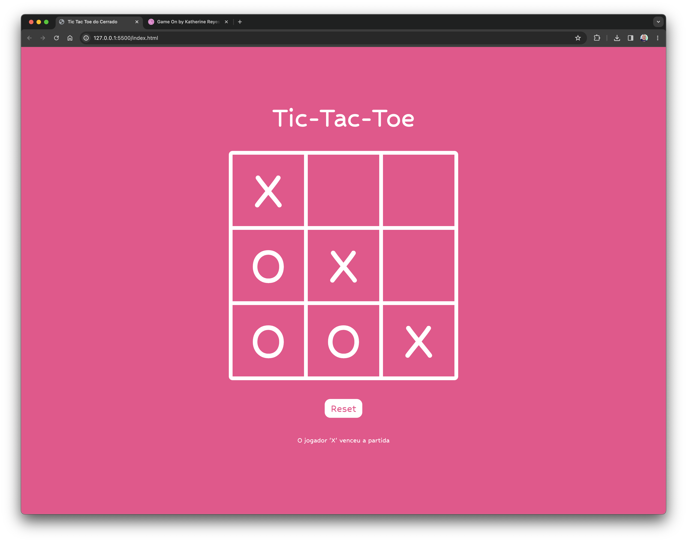
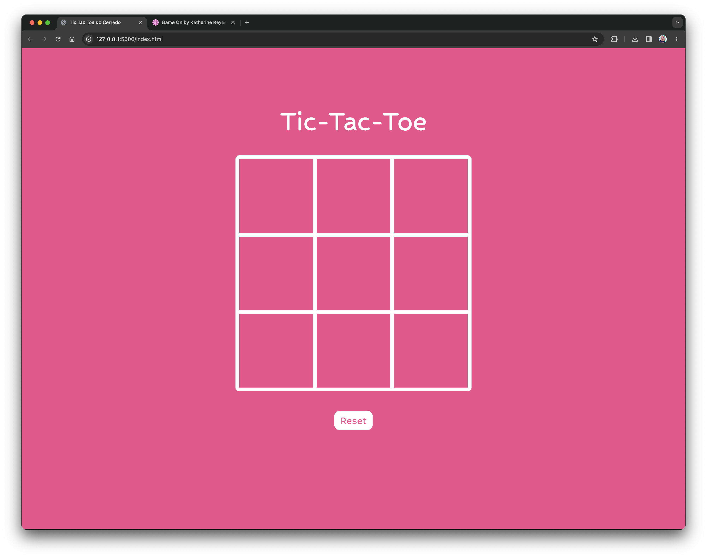

# (Quadro de Anotação e Desenho) Etch-a-Sketch

## Table of contents

- [Overview](#overview)
  - [The challenge](#the-challenge)
  - [Screenshots](#screenshots)
  - [Links](#links)
- [My process](#my-process)
  - [Built with](#built-with)
  - [What I learned](#what-i-learned)
  - [Continued development](#continued-development)
  - [Useful resources](#useful-resources)
- [Author](#author)

## Overview

### The challenge

Users should be able to:

- Play a tic-tac-toe game;
- Reset the board;
- See who won the game (if there is one).

### Screenshots




### Layout design credit

- Katherine Reyes: [Dribbble progile](https://dribbble.com/klreyes)

### Links

- Solution URL: [GithHub Repository](https://github.com/danielrsouza10/tic-tac-toe-javascript)
- Live Site URL: [Tic-tac-toe](https://danielrsouza10.github.io/tic-tac-toe-javascript/)

## My process

### Built with

- Semantic HTML5 markup
- CSS custom properties
- Flexbox
- Javascript Factory Functions and Module Pattern

### What I learned

Improved the manipulation of the DOM with JavaScript.
Improve Factory Functions on JavaScript.
Make clean HTML and CSS.

```js
const jogoDaVelha = {
  iniciar: () => {
    tabuleiro = ["", "", "", "", "", "", "", "", ""];
    container.addEventListener("click", jogoDaVelha.celulaClicada);

    for (i = 0; i < 9; i++) {
      let box = document.createElement("div");
      box.innerHTML = "";
      box.className = "box";
      box.dataset.index = i;
      container.appendChild(box);
    }
  },
  celulaClicada: (e) => {
    //index recebe o index da
    let index = e.target.attributes["data-index"].value;

    //verifica tabuleiro
    if ((tabuleiro[index] === "") & !jogoDaVelha.verificarVencedor()) {
      //tabuleiro recebe na posição do index a escolha do jogador atual
      tabuleiro[index] = jogadorAtual;
      //celula recebe a marcaçao do jogador atual
      e.target.textContent = jogadorAtual;
    }
    // console.log(index);
    // console.log(tabuleiro);
  },
  verificarVencedor: () => {
    //Este array contém todas as combinações possíveis de células no tabuleiro que podem resultar em uma vitória. Cada elemento do array linhasVitoriosas é, por sua vez, um array que representa uma combinação vitoriosa.
    const linhasVitoriosas = [
      [0, 1, 2],
      [3, 4, 5],
      [6, 7, 8], // Linhas horizontais
      [0, 3, 6],
      [1, 4, 7],
      [2, 5, 8], // Linhas verticais
      [0, 4, 8],
      [2, 4, 6], // Linhas diagonais
    ];

    for (const linha of linhasVitoriosas) {
      //desestrutura o array atual em linha em três variáveis individuais a, b e c. Essas variáveis representam as posições das células no tabuleiro que estão sendo verificadas para determinar se há uma vitória.
      const [a, b, c] = linha;
      //verifica se as células nas posições a, b e c do tabuleiro contêm o mesmo valor (ou seja, se todas são 'X' ou todas são 'O').
      if (
        tabuleiro[a] &&
        tabuleiro[a] === tabuleiro[b] &&
        tabuleiro[a] === tabuleiro[c]
      ) {
        container.removeEventListener("click", jogoDaVelha.celulaClicada);
        let vencedor = document.createElement("div");
        vencedor.textContent =
          "O jogador '" + jogadorAtual + "' venceu a partida";
        resultsDisplay.appendChild(vencedor);
        return true;
      }
    }
    // verifica e altera o jogador
    jogadorAtual = jogadorAtual == "X" ? "O" : "X";
    return false;
  },
};
```

### Continued development

Make it work the message when the game hits a draw;
Make the player choose between "X" and "O";
Make the computer to play against one person;

### Useful resources

- [The Odin Project](https://www.theodinproject.com) - This helped me for Factory Functions.

## Author

- Website - [Linkedin](https://www.linkedin.com/in/danielrsouza/)
- Instagram - [@danielrsouza](https://www.instagram.com/danielrsouza)

This is a solution to the [Tic-tac-toe](https://www.theodinproject.com/lessons/node-path-javascript-tic-tac-toe).
